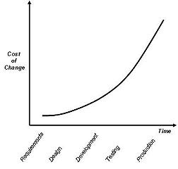
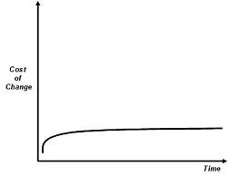

{} projects are based on the assumption that {} will dramatically increase through the life of a project, driving the neccesity to try and anticipate problems, and do {} in order to mitigate the risk of getting things wrong.

Projects using a more {} change the way they do things in order to flatten the {} curve, accepting that things may go wrong, they in effect say:

> _So if things probably will go wrong because we can't guess the future, instead of trying to get better at predicting the future, let's instead set things up to minimize the impact when the problem occurs!_

This is a fundamental decision that makes many practices common to {}, that at first sight may seem strange, actually essential to retain the ability to react to change at low cost and with low risk.

| Traditional Cost of Change | Agile Cost of Change       |
|:--------------------------:|:--------------------------:|
|   |  |